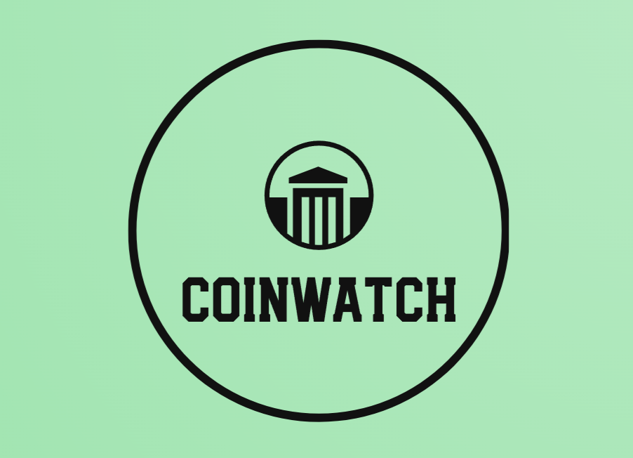

<h1 align="center">
  <br>
  
  <br>
  <br>
  CoinWatch
  <br>
</h1>

<h4 align="center">A React.js application which provides current data on the crypto market and news. Powered by RapidAPI's.</h4>

<hr>

## Built with

[](https://reactjs.org/) [](https://react-redux.js.org/)


## Dependencies Used
<p>
   
  
   
   
   <br>
  
  
  
  
  
</p>
<br>

<hr>

## How To Use

To clone and run this application, you'll need: 
* Coinranking [API](https://rapidapi.com/)
* [Git](https://git-scm.com)
* [Node.js](https://nodejs.org/en/download/) (which comes with [npm](http://npmjs.com))

Then, from your command line:

```bash
# Clone this repository
$ git clone https://github.com/andrearcaina/CoinWatch.git

# Go into the repository
$ cd CoinWatch/crypto-app

# Install dependencies
$ npm install

# Run the app
$ npm start
```

<hr>
