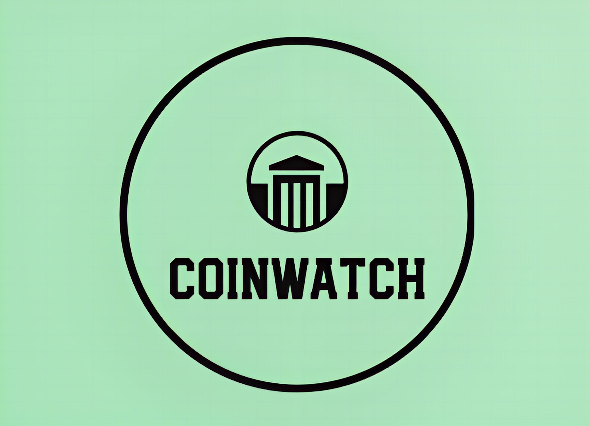

<h1 align="center">
  
</h1>

<h4 align="center">A React.js application which provides current data on the crypto market, prices, exchanges, and daily news. Powered by RapidAPI's.</h4>

<hr>

## Built with

[](https://reactjs.org/) [](https://react-redux.js.org/)

## Languages
[](https://developer.mozilla.org/en-US/docs/Web/JavaScript) 
[](https://www.w3.org/html/)
[](https://www.w3schools.com/css/)

## Dependencies Used
<p>
   
  
   
   
   <br>
  
  
  
  
  
</p>

<hr>

## How To Use

To clone and run this application, you'll need: 
* Coinranking & Bing News [API](https://rapidapi.com/)
* [Git](https://git-scm.com)
* [Node.js](https://nodejs.org/en/download/) (which comes with [npm](http://npmjs.com))

Then, from your command line:

```bash
# Clone this repository
$ git clone https://github.com/andrearcaina/CoinWatch.git

# Go into the repository
$ cd CoinWatch/crypto-app

# Install dependencies
$ npm install

# Run the app
$ npm start
```

<hr>

## What did I learn?
Ultimately, I learned how to use React.js, Redux, and creating a react app as a whole.
There's a whole thought process to it. If you mess up even installing the dependencies, you may mess the entire project and restart again (like I did). 
The good thing is, after restarting, I learned how to sucessfully install and utilize react to create a react app.
I can certainly say that this process of creating a react app can be transferred into different projects. 
Another thing is implementing API's and fetching data from current API's. I've learnt more from React-Redux and I can see
how much of a powerful tool it is in modern web applications.  I also changed a bit of stylings and designs.

Overall, the project was hard to create. There were a lot of things needed to implement, and a lot of code that was 
updated over the years (in React.js). There were so many bugs while testing, and a lot of problems I had to redo. 
Besides that, I've learnt more about cryptocurrencies through the news and even the market (how it works). Do I know how to invest still? Probably not.

<hr>
